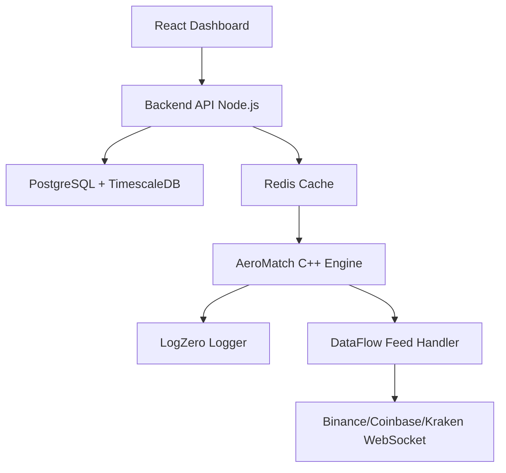

# MiniExchange

**India's first open-source, production-grade low-latency trading engine.**

[](https://isocpp.org/)
[](LICENSE)
[](https://github.com/omshreevinayak/miniexchange/stargazers)
[](https://github.com/omshreevinayak/miniexchange/issues)

---

##  Status: 
**Early Development** — Core engine design in progress. First working version (order book + matching) expected by July 2026.

---

## 🎯 Vision

To build **India's first open-source trading infrastructure**—a modular, high-performance engine that can be forked for security, AI, or embedded use cases (Ubuntu → Kali → Pop!_OS model).

---

##  What is MiniExchange?

MiniExchange is a **production-grade, low-latency trading engine** built from scratch in **C++20**. It is designed to process buy/sell orders with **microsecond latency** using lock-free data structures, custom memory pools, and epoll networking.

**This is not a toy project. This is India's first open-source trading infrastructure.**

---

## 🏗️ Architecture



# 1. Clone the repository
```text 
clone https://github.com/omshreevinayak/miniexchange.git
```

```text 
cd miniexchange
```

# 2. Start everything with one command
```text 
ocker-compose up -d
```

# 3. Access the dashboard
```text 
open http://localhost:3001
```

# 4. View API documentation
```text 
open http://localhost:3000/api/docs
```
